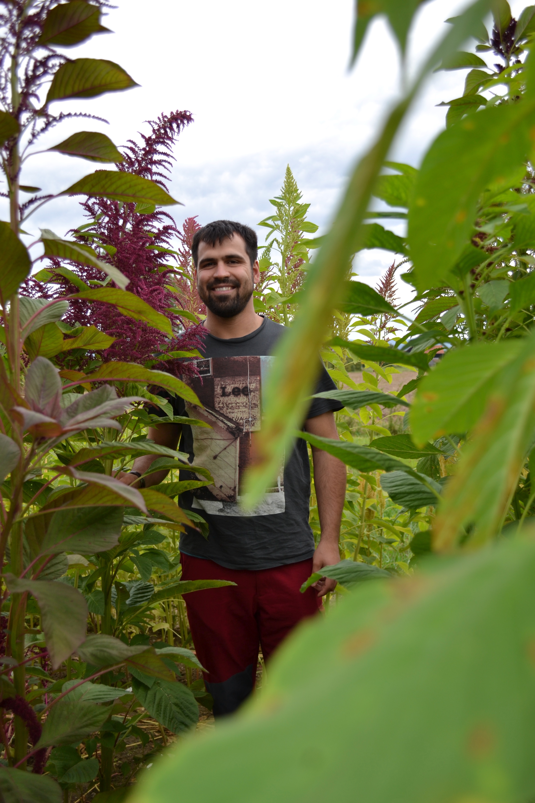

I am a scientist, programmer and amaranth breeder. Here I would like to give you some insights into my different projects.


```{r,echo=FALSE, eval=FALSE}
library(htmltools)
thumbnail <- function(title, img, href, caption = TRUE) {
  div(class = "col-sm-3",
      a(class = "thumbnail", title = title, href = href,
        img(src = img),
        div(class = ifelse(caption, "caption", ""),
          ifelse(caption, title, "")
        )
      )
  )
}
```

```{r, echo=FALSE, eval=FALSE}
thumbnail("Twitter", "own_images/me_2016.jpg", "https://twitter.com/mgstetter")
thumbnail("Science", "own_images/hyp_genome_fastAnc_with_BM.png", "science.html")
thumbnail("Breeding", "own_images/DSC_0020.jpg", "breeding.html")
thumbnail("Programming", "own_images/phenotype.png", "programming.html")

```


<div style="width:400px">

</div>


