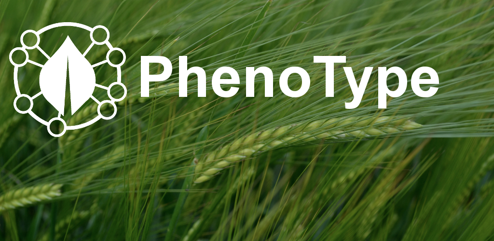
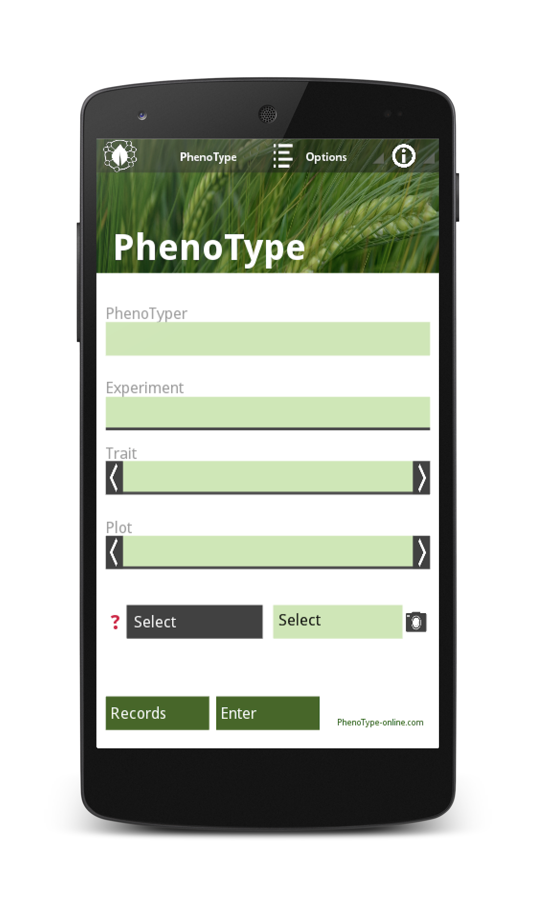

While I am not a trained programmer, I started learning Python during my undergraduate studies. Since then I have been trying to improve and was interested in mobile app programming. I program my apps in python and kivy.

PhenoType is my first large programming project. PhenoTpye is a digital field book allowing you to easily record data of experiments. It runs on Android devices and is therefore very flexible. To test PhenoType for free you can download PhenoType lite PhenoType lite PhenoType is efficient and easy to use. Just try.
Another app from the PhenoType family is PhenoType Camera which is a camera app that allows you to name the image files the way you want. This makes it easier to keep track of you images.

To learn more about the PhenoType projects visit [www.PhenoType-online.com](http://www.PhenoType-online.com)

