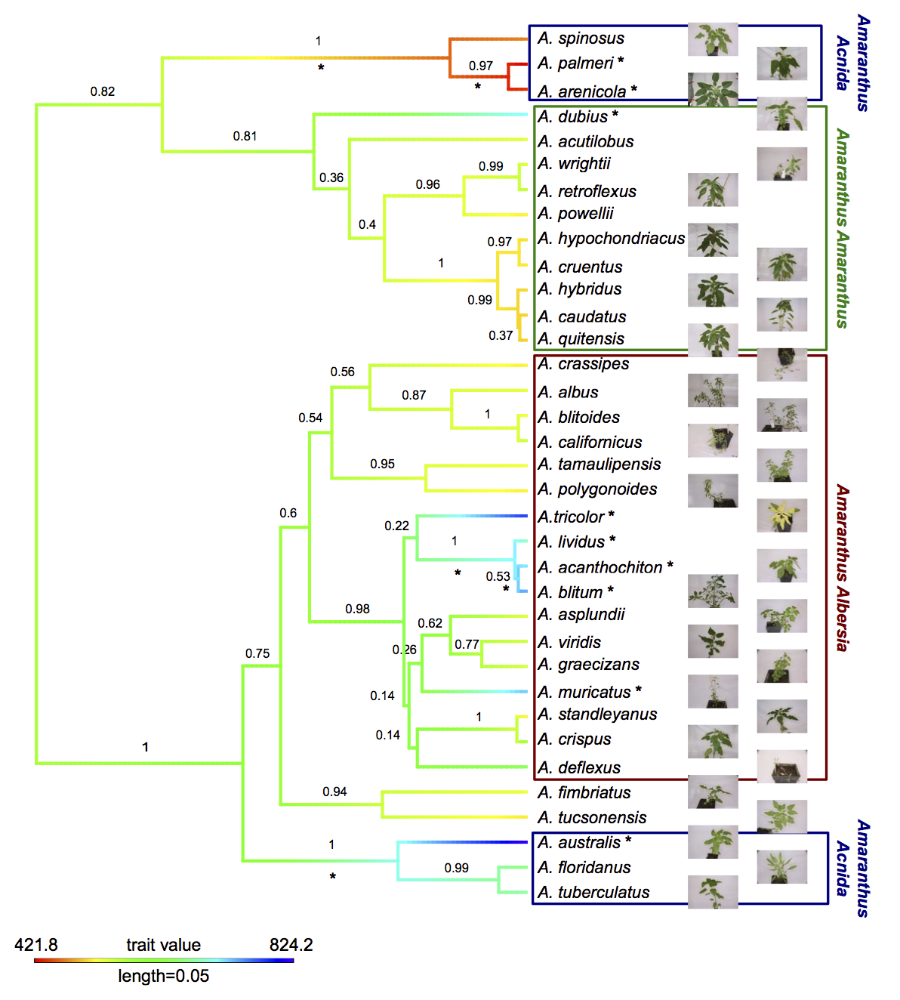

My main interest is the population genetics of crop domestication.

Since February 2017 I am a postdoc in the [Ross-Ibarra lab](http://www.rilab.org/) at the University of California Davis.

I did my PhD in the group of [Karl Schmid](http://evoplant.uni-hohenheim.de) at the University of Hohenheim. There I studied the evolution of the genus *Amaranthus* and domestication history of amaranth. 

#  Domestication and adaptation in modern and ancient maize.

Details coming soon

# Domestication genomics of amaranth

The genus Amaranthus comprises several crop species that are potentially only partially domesticated. Additionally, grain amaranth seeds have a high nutritional value and the crop has high potential to contribute to human nutrition in the future. Together, these characteristics make the genus, and in particular grain amaranth, interesting models to study domestication, genome evolution and breeding methods.



Although grain amaranth has been cultivated for over 5,000 years and in the same regions as maize and other domesticated crops, the domestication syndrome is only weakly pronounced. Grain amaranth has tiny seeds that shatter and cultivated amaranth species do not have lower genetic diversity than their wild ancestors.
Therefore, the genomic and phenotypic signatures of amaranth domestication differ from other, highly domesticated crops that originated from single domestication event. In contrast, the history of cultivated amaranth may include multiregional, multiple and incomplete domestication events with frequent and ongoing gene flow from sympatric relatives. 


```{r,eval=FALSE,include=FALSE}
<div style="width:300px">

</div>
```


<script>
  (function(i,s,o,g,r,a,m){i['GoogleAnalyticsObject']=r;i[r]=i[r]||function(){
  (i[r].q=i[r].q||[]).push(arguments)},i[r].l=1*new Date();a=s.createElement(o),
  m=s.getElementsByTagName(o)[0];a.async=1;a.src=g;m.parentNode.insertBefore(a,m)
  })(window,document,'script','https://www.google-analytics.com/analytics.js','ga');

  ga('create', 'UA-96594188-1', 'auto');
  ga('send', 'pageview');

</script>