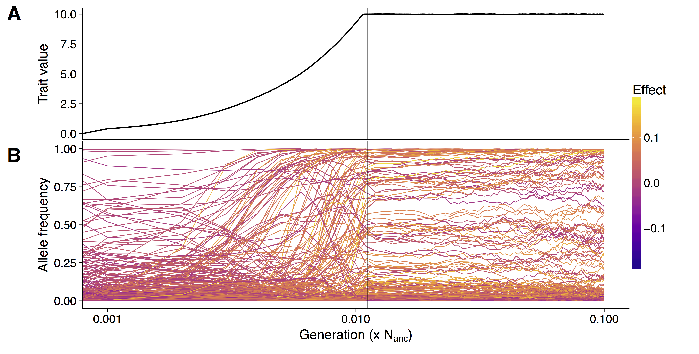

&nbsp;

# Polygenic adaptation.

In population genetics it has for long been assumed that hard selective sweeps are the predominant mode of adaptation.
Hard sweeps result from the reduction of genetic diversity in neutral sites close to a new beneficial mutation that increase fast in frequency.
In recent years it has become clearer that different patters play an important role in evolution and adaption.
Soft sweeps that arise from standing genetic variation or multiple mutations with equal effects are more difficult to detect, but also assume that there are few loci of large effect leading to a phenotypic adaptation.
A third mode of adaptation -- polygenic adaptation -- predicts that a trait is controlled by hundreds of loci of small effects that can lead strong phenotypic adaptation by minor shifts in allele frequencies.

Although well studied traits such as human height, bristle number in Drosophila and grain yield in crops have been identified to follow a polygenic pattern, the genetic architecture of quantitative trait adaptation under changing demographies is not well understood.

I study how quantitative traits adapt to changing environments employing forward in time simulations. 
Understanding how simulated populations adapt to changing environments is important to be able to breed better crops for changing climate and to protect wild populations from extinction.
Simulated populations allow to study the change of trait values over time and each mutation observing its allele frequency change.



Crop domestication is a well-suited model to study polygenic adaptation, because strong selection shaped the phenotype of crops in evolutionary short time.
Additionally, for many crops, such as maize, phenotype and genotype data is available for a large number of individuals over many generations.


# Domestication genomics of amaranth

The genus Amaranthus comprises several crop species that are potentially only partially domesticated. Additionally, grain amaranth seeds have a high nutritional value and the crop has high potential to contribute to human nutrition in the future. Together, these characteristics make the genus, and in particular grain amaranth, interesting models to study domestication, genome evolution and breeding methods.


Although grain amaranth has been cultivated for over 5,000 years and in the same regions as maize and other domesticated crops, the domestication syndrome is only weakly pronounced. Grain amaranth has tiny seeds that shatter and cultivated amaranth species do not have lower genetic diversity than their wild ancestors.
Therefore, the genomic and phenotypic signatures of amaranth domestication differ from other, highly domesticated crops that originated from single domestication event. In contrast, the history of cultivated amaranth may include multiregional, multiple and incomplete domestication events with frequent and ongoing gene flow from sympatric relatives. 


```{r,eval=FALSE,include=FALSE}
<div style="width:300px">

</div>
```


<script>
  (function(i,s,o,g,r,a,m){i['GoogleAnalyticsObject']=r;i[r]=i[r]||function(){
  (i[r].q=i[r].q||[]).push(arguments)},i[r].l=1*new Date();a=s.createElement(o),
  m=s.getElementsByTagName(o)[0];a.async=1;a.src=g;m.parentNode.insertBefore(a,m)
  })(window,document,'script','https://www.google-analytics.com/analytics.js','ga');

  ga('create', 'UA-96594188-1', 'auto');
  ga('send', 'pageview');

</script>